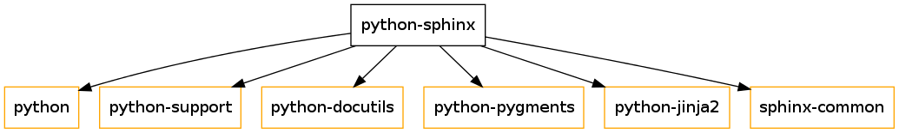
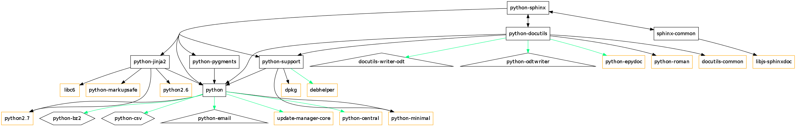
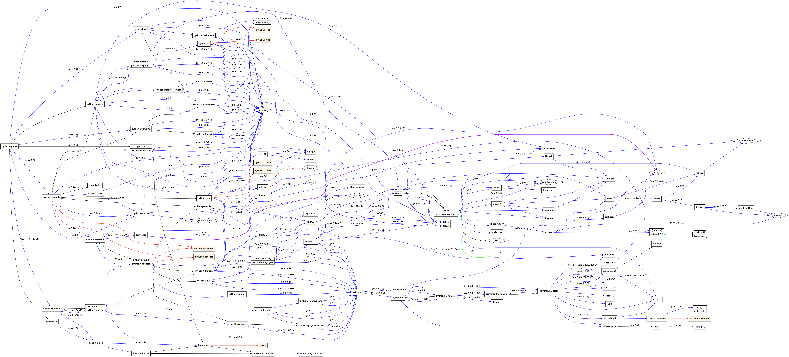
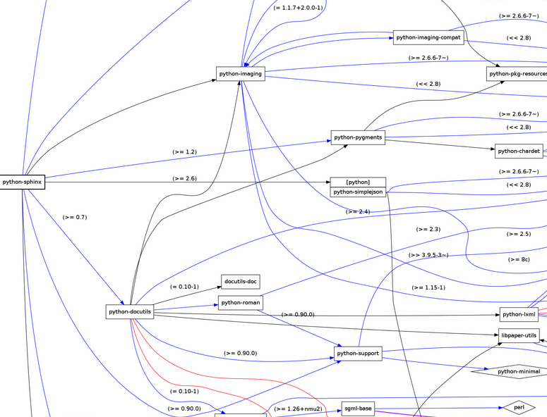
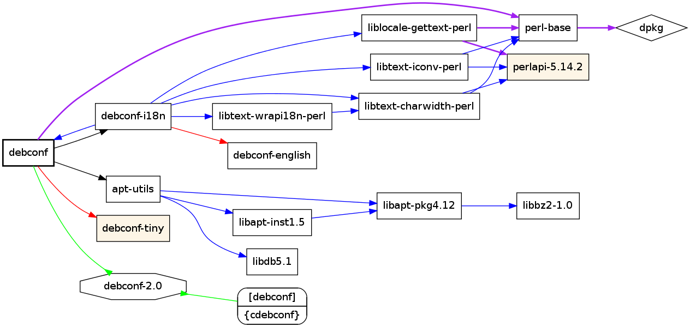
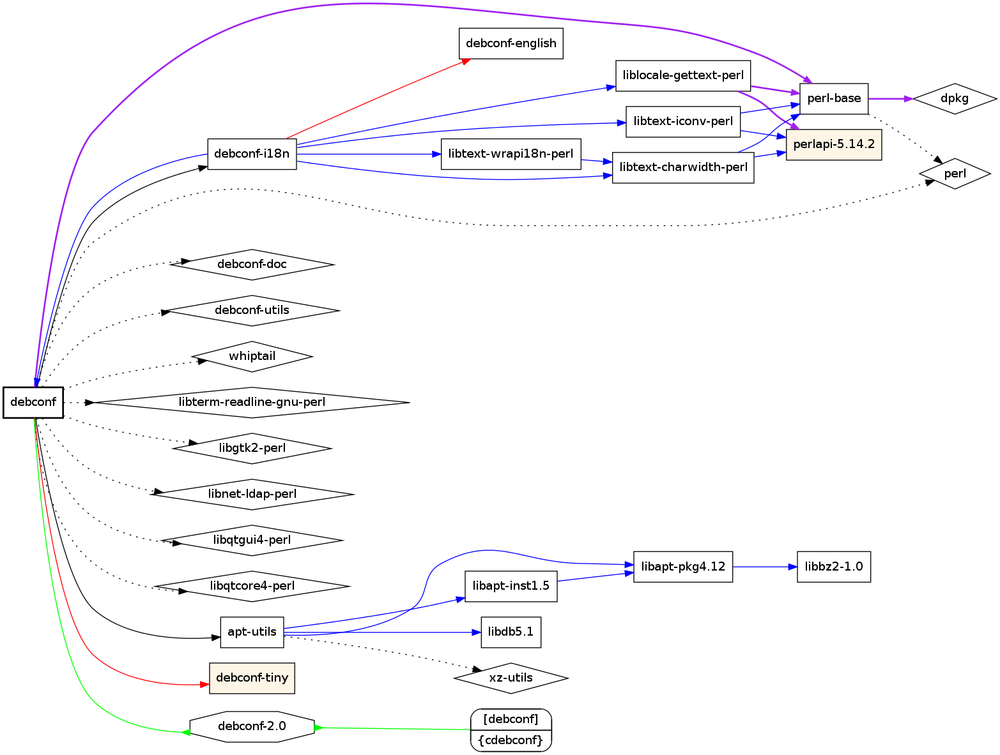

=========================================
Debianパッケージ情報と依存関係の可視化
=========================================

（発表時のスライドは http://www.slideshare.net/minimum2scp/20130328-03debian-debian にアップしています）

Debian パッケージ情報
------------------------

apt-cache show や apt-cache dumpavail を使用して、Debianパッケージの情報を見ることができます。

::

  % apt-cache show パッケージ名
  % apt-cache dumpavail

.. note::

  このコマンドで出力される情報の形式にちゃんとした名前がついているのかは分かりませんが、
  書籍「入門Debianパッケージ」では "Debianパッケージ情報形式" と記述されていたので、
  今回の発表でもそれに倣います。

Debian パッケージ情報の例
**************************

apt-cache show で表示されるパッケージ情報の例をいくつかあげます。
（適当に改行を入れたり省略したりしています）

pyhton-sphinx パッケージの場合

::

  Package: python-sphinx
  Source: sphinx
  Version: 1.1.3+dfsg-4
  (...snip...)
  Depends: python (>= 2.5), python-support (>= 0.90.0),
   python-docutils (>= 0.7), python-pygments (>= 1.2),
   python-jinja2 (>= 2.3), sphinx-common (= 1.1.3+dfsg-4)
  Recommends: python (>= 2.6) | python-simplejson,
   python-imaging, sphinx-doc
  Suggests: jsmath, libjs-mathjax, texlive-latex-recommended,
   texlive-latex-extra, texlive-fonts-recommended
   (...snip...)

rubyパッケージの場合

::

  Package: ruby
  (...snip...)
  Replaces: irb, rdoc
  Provides: irb, rdoc
  Depends: ruby1.9.1 (>= 1.9.3.194-1)
  Suggests: ri, ruby-dev
  Conflicts: irb, rdoc
  Breaks: apt-listbugs (<< 0.1.6)
  (...snip...)

openssh-server の場合

::

  Package: openssh-server
  (...snip...)
  Replaces: openssh-client (<< 1:3.8.1p1-11), ssh, ssh-krb5
  Provides: ssh-server
  Depends: libc6 (>= 2.8), libcomerr2 (>= 1.01), libgssapi-krb5-2 (>= 1.10+dfsg~), libkrb5-3 (>= 1.6.dfsg.2), libpam0g (>= 0.99.7.1), libselinux1 (>= 1.32), libssl1.0.0 (>= 1.0.1), libwrap0 (>= 7.6-4~), zlib1g (>= 1:1.1.4), debconf (>= 1.2.0) | debconf-2.0, openssh-client (= 1:6.0p1-4), libpam-runtime (>= 0.76-14), libpam-modules (>= 0.72-9), adduser (>= 3.9), dpkg (>= 1.9.0), lsb-base (>= 3.2-13), procps
  Recommends: xauth, ncurses-term, openssh-blacklist, openssh-blacklist-extra
  Suggests: ssh-askpass, rssh, molly-guard, ufw, monkeysphere
  Conflicts: rsh-client (<< 0.16.1-1), sftp, ssh (<< 1:3.8.1p1-9), ssh-krb5 (<< 1:4.3p2-7), ssh-nonfree (<< 2), ssh-socks, ssh2
  (...snip...)

Debian パッケージのインストール
***********************************

apt-get install でパッケージをインストールする際には、これらパッケージ情報の
Depends, Recommends, Suggests などの情報を参照し依存関係を自動的に解決して
インストールが行なわれます。

実際にapt-get installでpython-sphinx, ruby, openssh-serverを
インストールしようとしたとき、以下のような表示が出力されます。

::

  # apt-get install python-sphinx
  Reading package lists... Done
  Building dependency tree       
  Reading state information... Done
  The following extra packages will be installed:
    docutils-common docutils-doc file javascript-common libexpat1 libfreetype6 libgcrypt11 libgpg-error0 libjpeg8 libjs-jquery libjs-sphinxdoc libjs-underscore liblcms1
    libmagic1 libpaper-utils libpaper1 libssl1.0.0 libxml2 libxslt1.1 mime-support python python-chardet python-docutils python-imaging python-jinja2 python-lxml
    python-markupsafe python-minimal python-pkg-resources python-pygments python-roman python-support python2.7 python2.7-minimal sgml-base sphinx-common sphinx-doc ucf
    wwwconfig-common xml-core
  Suggested packages:
    apache2 httpd rng-tools liblcms-utils python-doc python-tk texlive-latex-recommended texlive-latex-base texlive-lang-french fonts-linuxlibertine ttf-linux-libertine
    python-imaging-doc python-imaging-dbg python-jinja2-doc python-lxml-dbg python-distribute python-distribute-doc ttf-bitstream-vera jsmath libjs-mathjax
    texlive-latex-extra texlive-fonts-recommended python2.7-doc binfmt-support sgml-base-doc mysql-client postgresql-client debhelper
  The following NEW packages will be installed:
    docutils-common docutils-doc file javascript-common libexpat1 libfreetype6 libgcrypt11 libgpg-error0 libjpeg8 libjs-jquery libjs-sphinxdoc libjs-underscore liblcms1
    libmagic1 libpaper-utils libpaper1 libssl1.0.0 libxml2 libxslt1.1 mime-support python python-chardet python-docutils python-imaging python-jinja2 python-lxml
    python-markupsafe python-minimal python-pkg-resources python-pygments python-roman python-sphinx python-support python2.7 python2.7-minimal sgml-base sphinx-common
    sphinx-doc ucf wwwconfig-common xml-core
  0 upgraded, 41 newly installed, 0 to remove and 0 not upgraded.
  Need to get 254 kB/15.2 MB of archives.
  After this operation, 50.1 MB of additional disk space will be used.
  Do you want to continue [Y/n]? 

::

  # apt-get install ruby
  Reading package lists... Done
  Building dependency tree       
  Reading state information... Done
  The following extra packages will be installed:
    libffi5 libruby1.9.1 libssl1.0.0 libyaml-0-2 ruby1.9.1
  Suggested packages:
    ri ruby-dev ruby1.9.1-examples ri1.9.1 graphviz ruby1.9.1-dev ruby-switch
  The following NEW packages will be installed:
    libffi5 libruby1.9.1 libssl1.0.0 libyaml-0-2 ruby ruby1.9.1
  0 upgraded, 6 newly installed, 0 to remove and 0 not upgraded.
  Need to get 4712 kB/5931 kB of archives.
  After this operation, 16.2 MB of additional disk space will be used.
  Do you want to continue [Y/n]?

::

  # apt-get install openssh-server
  Reading package lists... Done
  Building dependency tree       
  Reading state information... Done
  The following extra packages will be installed:
    adduser krb5-locales libbsd0 libedit2 libgssapi-krb5-2 libk5crypto3 libkeyutils1 libkrb5-3 libkrb5support0 libprocps0 libssl1.0.0 libwrap0 libx11-6 libx11-data
    libxau6 libxcb1 libxdmcp6 libxext6 libxmuu1 ncurses-term openssh-blacklist openssh-blacklist-extra openssh-client procps psmisc tcpd xauth
  Suggested packages:
    krb5-doc krb5-user ssh-askpass libpam-ssh keychain monkeysphere rssh molly-guard ufw
  The following NEW packages will be installed:
    adduser krb5-locales libbsd0 libedit2 libgssapi-krb5-2 libk5crypto3 libkeyutils1 libkrb5-3 libkrb5support0 libprocps0 libssl1.0.0 libwrap0 libx11-6 libx11-data
    libxau6 libxcb1 libxdmcp6 libxext6 libxmuu1 ncurses-term openssh-blacklist openssh-blacklist-extra openssh-client openssh-server procps psmisc tcpd xauth
  0 upgraded, 28 newly installed, 0 to remove and 0 not upgraded.
  Need to get 8663 kB/11.3 MB of archives.
  After this operation, 26.8 MB of additional disk space will be used.
  Do you want to continue [Y/n]? 

Debian リファレンス 2.1.6 パッケージ依存関係
----------------------------------------------

依存関係を宣言している、Depends, Recommends, Suggests 等の説明は、
Debianプロジェクトのドキュメントである、
「Debian リファレンス」の「2.1.6 パッケージ依存関係」に記載されています。
(http://www.debian.org/doc/manuals/debian-reference/ch02.ja.html#_package_dependencies)

Depends, Recommends, Suggests 等の説明をこのドキュメントから引用します。

Depends
********

"これは絶対依存を宣言し、このフィールドにリストされた全てのパッケージは同時または事前にインストールされていなければいけません。"

例えば git パッケージの場合は以下のようになっています:

::

  Depends: libc6 (>= 2.9), libcurl3-gnutls (>= 7.16.2), libexpat1 (>= 2.0.1), zlib1g (>= 1:1.2.0),
    perl-modules, liberror-perl, git-man (>> 1:1.7.10.4), git-man (<< 1:1.7.10.4-.)

Pre-Depends
************

"これは、リストされたパッケージが事前にインストールを完了している必要がある以外は、Depends と同様です。"

Pre-Depends を指定しているパッケージの例:

=============     ==========================================================================================================================
パッケージ        Pre-Dependsフィールド
=============     ==========================================================================================================================
debconf           perl-base (>= 5.6.1-4)
diffutils         libc6 (>= 2.4)
dpkg              libbz2-1.0, libc6 (>= 2.11), liblzma5 (>= 5.1.1alpha+20120614), libselinux1 (>= 1.32), zlib1g (>= 1:1.1.4), tar (>= 1.23)
perl-base         libc6 (>= 2.11), dpkg (>= 1.14.20)
=============     ==========================================================================================================================

.. note::

  最近は multiarch-support パッケージを指定するパッケージが増えているそうです

Recommends
************

"これは強いが絶対でない依存を宣言します。多くのユーザーはこのフィールドにリストされたパッケージ全てがインストールされていなければ、当該パッケージを望まないでしょう。"

git パッケージの例:

::

  Recommends: patch, less, rsync, ssh-client

Suggests
*********

"これは弱い依存を宣言します。このパッケージの多くのユーザーはこのフィールドにリストされたパッケージをインストールすればメリットを享受できるとは言え、それら抜きでも十分な機能が得られます。"

git パッケージの例:

::

  Suggests: gettext-base, git-daemon-run | git-daemon-sysvinit, git-doc,
    git-el, git-arch, git-cvs, git-svn, git-email, git-gui, gitk, gitweb

Recommends, Suggests のパッケージのインストールの制御
**********************************************************

=====================  =============================================  ===========================================
Recommends             通常インストールされる                         | インストールしない場合は
                                                                      | apt-get install --no-install-recommends
Suggests               通常インストールされない                       | インストールする場合は
                                                                      | apt-get install --install-suggests
=====================  =============================================  ===========================================

『通常』.../etc/apt 以下の設定にもよる

 * APT::Install-Recommends
 * APT::Install-Suggests

.. note::

  あまりに多すぎるパッケージがインストールされるために、
  実際に "apt-get install --install-suggests" を使うことはまずないと思います。
  Suggests に宣言されているパッケージから取捨選択してインストールするのが良いと思います。

Enhances
*********

"これは Suggests 同様の弱い依存を宣言しますが、依存作用の方向が逆です。"

Enhances を指定しているパッケージの例

==================      =======================================
パッケージ              Enhancesフィールド
==================      =======================================
autossh                 openssh-client, ssh-client
dbskkd-cdb              skk
libvirt-bin             qemu, qemu-kvm, xen
mysql-utilities         mysql-workbench
==================      =======================================

Breaks, Conflicts, Replaces, Provides
**************************************

Breaks
  "通常バージョン制約付きでパッケージのインコンパチビリティーを宣言します。一般的にこのフィールドにリストされた全てのパッケージをアップグレードすることで解決します。"
Conflicts
  "絶対的排他関係を宣言します。このフィールドにリストされた全てのパッケージを除去しない限り当該パッケージをインストールできません。"
Replaces
  "当該パッケージによりインストールされるファイルがこのフィールドにリストされたパッケージのファイルを置き換える際にこれを宣言します。"
Provides
  "当該パッケージがこのフィールドにリストされたパッケージのファイルと機能の全てを提供する際にこれを宣言します。"

バーチャルパッケージ
**********************

"正常な設定として "Provides" と "Conflicts" と "Replaces" とを単一バーチャルパッケージに対し同時宣言することがあります。こうするといかなる時にも当該バーチャルパッケージを提供する実パッケージのうち確実に一つだけがインストールされます。"

バーチャルパッケージの例: mail-transfer-agent
**************************************************

バーチャルパッケージの例として、mail-transfer-agent を紹介します。

.. note::

  Debian では標準でインストールされる MTA として exim4 がありますが、
  exim4-daemon-heavy, exim4-daemon-light パッケージの Providesフィールドには mail-transfer-agent が指定されています。

  代表的な MTA として postfix, sendmail がありますが、postfix パッケージや sendmail-bin パッケージでも mail-transfer-agent を Provide に指定してあります。
  また、これらパッケージでは Replaces, Conflicts に mail-transfer-agent が指定されています。
  この結果として、postfix, sendmail (sendmail-bin), exim4 (exim4-daemon-light または exim4-daemon-heavy) といった
  パッケージはどれか1つしかインストールすることはできないようになっています。

postfix のパッケージ情報

::

  Package: postfix
  Version: 2.10.0-3
  Installed-Size: 3522
  Maintainer: LaMont Jones <lamont@debian.org>
  Architecture: amd64
  Replaces: mail-transport-agent
  Provides: mail-transport-agent
  Depends: libc6 (>= 2.11), libdb5.1, libsasl2-2 (>= 2.1.24), libsqlite3-0 (>= 3.5.9), libssl1.0.0 (>= 1.0.0), debconf (>= 0.5) | debconf-2.0, netbase, adduser (>= 3.48), dpkg (>= 1.8.3), lsb-base (>= 3.0-6), ssl-cert, cpio
  Recommends: python
  Suggests: procmail, postfix-mysql, postfix-pgsql, postfix-ldap, postfix-pcre, sasl2-bin, libsasl2-modules, dovecot-common, resolvconf, postfix-cdb, mail-reader, ufw, postfix-doc
  Conflicts: libnss-db (<< 2.2-3), mail-transport-agent, smail
  Description-en: High-performance mail transport agent
   Postfix is Wietse Venema's mail transport agent that started life as an
   alternative to the widely-used Sendmail program.  Postfix attempts to
   be fast, easy to administer, and secure, while at the same time being
   sendmail compatible enough to not upset existing users. Thus, the outside
   has a sendmail-ish flavor, but the inside is completely different.
  (...snip...)

exim4-daemon-light のパッケージ情報

::

  Package: exim4-daemon-light
  Source: exim4
  Version: 4.80-7
  Installed-Size: 1156
  Maintainer: Exim4 Maintainers <pkg-exim4-maintainers@lists.alioth.debian.org>
  Architecture: amd64
  Replaces: exim4-base (<= 4.61-1), mail-transport-agent
  Provides: default-mta, exim4-localscanapi-1.0, exim4-localscanapi-1.1, mail-transport-agent
  Depends: exim4-base (>= 4.80), libc6 (>= 2.4), libdb5.1, libgnutls26 (>= 2.12.17-0), libpcre3 (>= 8.10), debconf (>= 0.5) | debconf-2.0
  Conflicts: mail-transport-agent
  Description-en: lightweight Exim MTA (v4) daemon
   Exim (v4) is a mail transport agent. This package contains the exim4
   daemon with only basic features enabled. It works well with the
   standard setups that are provided by Debian and includes support for
   TLS encryption and the dlopen patch to allow dynamic loading of a
   local_scan function.
   .
  (...snip...)

sendmail-bin のパケージ情報

::

  Package: sendmail-bin
  Source: sendmail
  Version: 8.14.4-4
  Installed-Size: 1832
  Maintainer: Jakub Safarik <jsafarik@ymail.com>
  Architecture: amd64
  Replaces: mail-transport-agent
  Provides: mail-transport-agent
  Depends: sendmail-base, sendmail-cf, procps, libc6 (>= 2.4), libdb5.1, libldap-2.4-2 (>= 2.4.7), liblockfile1 (>= 1.0), libsasl2-2 (>= 2.1.24), libssl1.0.0 (>= 1.0.0), libwrap0 (>= 7.6-4~)
  Suggests: sendmail-doc, sasl2-bin, libsasl2-modules, openssl
  Conflicts: mail-transport-agent
  Description-en: powerful, efficient, and scalable Mail Transport Agent
   Sendmail is an alternative Mail Transport Agent (MTA) for Debian.
   It is suitable for handling sophisticated mail configurations,
   although this means that its configuration can also be complex.
   .
  (...snip...)

cron パッケージを見ると、Suggests フィールドに mail-transfer-agent を指定しています

::

  Package: cron
  Version: 3.0pl1-124
  Installed-Size: 300
  Maintainer: Javier Fernández-Sanguino Peña <jfs@debian.org>
  Architecture: amd64
  Provides: cron-daemon
  Depends: libc6 (>= 2.7), libpam0g (>= 0.99.7.1), libselinux1 (>= 1.32), debianutils (>= 1.7), adduser, lsb-base (>= 3.0-10), libpam-runtime (>= 1.0.1-11)
  Pre-Depends: dpkg (>= 1.15.7.2)
  Recommends: exim4 | postfix | mail-transport-agent
  Suggests: anacron (>= 2.0-1), logrotate, checksecurity
  Breaks: dpkg (<< 1.15.4)
  Description-en: process scheduling daemon
   The cron daemon is a background process that runs particular programs at
   particular times (for example, every minute, day, week, or month), as
   specified in a crontab. By default, users may also create crontabs of
   their own so that processes are run on their behalf.
   .
   Output from the commands is usually mailed to the system administrator
   (or to the user in question); you should probably install a mail system
   as well so that you can receive these messages.
   .
  (...snip...)

Debian Policy Manual
*********************

これら依存関係についてのより詳しいドキュメントは、
"Debian Policy Manual" の 
"Chapter 7 - Declaring relationships between packages" (http://www.debian.org/doc/debian-policy/ch-relationships.html)
があります。

また、この日本語訳「Debianポリシーマニュアル」
が Debian JP Project にあります (http://www.debian.or.jp/community/devel/debian-policy-ja/policy.ja.html/ch-relationships.html)

依存関係の可視化
-----------------

apt-cache show でパッケージAを調べ、そしてその Depends や Recommends に宣言されている
他のパッケージをまた apt-cache show で調べ、という手順でパッケージの依存関係を
追いかけていくことができるのですが、簡単に俯瞰すべく依存関係を可視化したい、
というニーズに答えるツールを紹介します。

apt-cache dotty
******************

apt-cache には dotty というサブコマンドがあります。

apt-cache のマニュアルを引用します。

::

  dotty パッケージ...

  dotty は、コマンドライン上のパッケージ名から、GraphViz[1] パッケージの dotty コマンドで利用するのに便利な出力を生成します。結果はパッケージの関係を表わ
  す、ノード・エッジのセットで表現されます。デフォルトでは、すべての依存パッケージをトレースするので、非常に大きい図が得られます。コマンドラインに列挙した
  パッケージだけを出力するように制限するには、APT::Cache::GivenOnly をセットしてください。
  
  結果のノードは数種の形状をとります。通常パッケージは四角、純粋仮想パッケージは三角、複合仮想パッケージは菱形、欠落パッケージは六角形で表します。オレンジ
  の四角は再帰が終了した「リーフパッケージ」、青い線は先行依存、緑の線は競合を表します。
  
  注意) dotty は、パッケージのより大きなセットのグラフは描けません。

apt-cache dotty python-sphinx
*******************************

python-sphinx パッケージのグラフを書くために、以下のコマンドを実行してみましたが、
dot コマンドによる変換が数分かかっても終わりませんでした（その前にPCのファンが高速回転しCPU温度が危険なほど上昇）。
dot ファイルの内容は 2万行を越えていました。

::

  % apt-cache dotty python-sphinx > /tmp/python-sphinx.dot
  % dot -Tsvg -o /tmp/python-sphinx.svg /tmp/python-sphinx.dot

マニュアルに書いてある通り、APT::Cache::GivenOnly をセットして実行すると、
画像が生成されました。

::

  % apt-cache dotty -o APT::Cache::GivenOnly=yes python-sphinx > /tmp/python-sphinx.dot
  % dot -Tsvg -o /tmp/python-sphinx.svg /tmp/python-sphinx.dot

python-sphinx パッケージの Depends フィールドに宣言されているパッケージだけが
グラフになっています。

Depends フィールドに宣言されているパッケージをコマンドライン引数に追加し、
第2階層の依存までグラフにしてみます。

::

  % apt-cache dotty -o APT::Cache::GivenOnly=yes python-sphinx
    python python-support python-pygments python-jinja2 sphinx-common \
    > /tmp/python-sphinx.dot
  % dot -Tsvg -o /tmp/python-sphinx.svg /tmp/python-sphinx.dot

グラフが大きくなりましたが、Dependsフィールドを再帰していくのは大変です

debtree
***********

debtree (http://collab-maint.alioth.debian.org/debtree/) というものがあります。

これも apt-cache dotty と同様に、パッケージの依存関係を DOT 言語で出力してくれるツールです。

python-sphinx パッケージのグラフを生成してみると以下のように簡単にグラフにすることができます。

::
  
  % debtree python-sphinx > /tmp/python-sphinx.dot
  % dot -Tsvg -o /tmp/python-sphinx.svg /tmp/python-sphinx.dot

一番左に python-sphinx パッケージがあり、そこから依存しているパッケージなどが
矢印で右へつながっていくグラフになっています。

debtree グラフの凡例
**********************

python-sphinx パッケージのグラフでは大きすぎて説明しづらいので、
debconf パッケージのグラフで説明します。

debtree で生成されるグラフ中では、Depends 以外にも Pre-Depends, Confclicts, Provides, Recommends, Suggests
も含めて描画されています（debtree コマンドへのオプションにもよります）

このグラフでは、 Depends, Pre-Depends, Provides, Conflicts が描画されています。

=============  ===============
関係性         矢印の種類
=============  ===============
Pre-Depends    紫の実線
Depends        青の実線
Conflicts      赤の実線
Provides       緑の実線
=============  ===============

このグラフでは Suggests フィールドも追加されており、たくさんのパッケージが追加されています。

=============  ===============
関係性         矢印の種類
=============  ===============
Recommends     黒の実線
Suggests       黒の点線
=============  ===============

debtree-web.rb の紹介
************************

debtree コマンドにはたくさんのオプションがあり覚えきれないことと、
dot コマンドも含めてコマンド実行が面倒だったことから、
もっと手軽にグラフを見ることができるように debtree-web.rb というwebインターフェースを作成しました。
(https://gist.github.com/minimum2scp/5252671)

* ruby + sinatra で作成
* もともと debtree 用だったものを、発表前日に apt-cache dotty にも対応

（発表のときにここでちょっとしたデモ）

